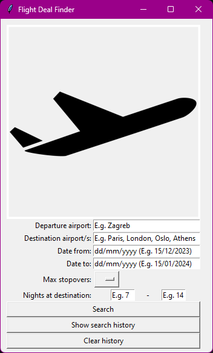

# Flight Deal Finder

Welcome to the Flight Deal Finder! This application allows you to search for flight deals, view your search history, and clear your search history. The application uses the Kiwi.com API to fetch flight data and displays the cheapest options based on your criteria.

## Features

- **Search for flights**: Enter departure and destination airports, travel dates, max stopovers, and duration of stay to find the best flight deals.
- **View search history**: Access and review previous search results.
- **Clear search history**: Delete all previous search records from the database.

## Screenshots

## Requirements

- Python 3.x
- Kiwi.com API key

## Example

1. Open the application by running `main.py`.
2. Enter "Zagreb" in the departure airport field.
3. Enter "Paris, London, Oslo, Athens" in the destination airport/s field.
4. Enter "15/12/2023" in the "Date from" field and "15/01/2024" in the "Date to" field.
5. Select "1" as the maximum stopovers.
6. Enter "7" in the minimum nights field and "14" in the maximum nights field.
7. Click the "Search" button to find flight deals.

## File Structure

- `main.py`: The main application file containing the GUI and logic to handle user input.
- `FlightSearch.py`: Handles API requests, processes search results, and interacts with the database.
- `Flight.py`: Defines the Flight class, representing a flight's details.
- `DataManager.py`: Manages search history, including displaying and clearing previous searches.

## Contributing

Contributions and bug reports are welcome! Please create a pull request with a detailed description of your changes.
